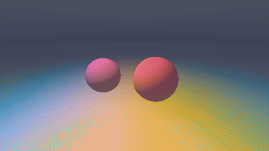

<div align="center">

# wgpu-mojo

**WebGPU for [Mojo](https://www.modular.com/mojo) — pure bindings to [wgpu-native](https://github.com/gfx-rs/wgpu-native), with RAII GPU objects and a 5-line compute facade.**

[](https://github.com/Hundo1018/wgpu-mojo/actions/workflows/ci.yml)
[](https://github.com/Hundo1018/wgpu-mojo/actions/workflows/consume.yml)
[](LICENSE)
[](#drivers--platforms)
[](https://github.com/gfx-rs/wgpu-native)

Compute *and* graphics on every backend Vulkan / Metal / DX12 supports — from a single Mojo program.

</div>

<table>
<tr>
<td width="33%"></td>
<td width="33%"></td>
<td width="33%"></td>
</tr>
<tr>
<td align="center"><code>example-plasma</code><br/>fullscreen fragment shader</td>
<td align="center"><code>example-metaballs</code><br/>2D signed distance fields</td>
<td align="center"><code>example-raymarch</code><br/>raymarched 3D SDF</td>
</tr>
</table>

---

## Why wgpu-mojo

- **Pure Mojo** — no Python in the hot path. `from wgpu import …` resolves at compile time.
- **RAII by default** — every GPU object frees its native handle when it goes out of scope.
- **Two altitudes** — a [low-level API](#api-reference) that maps 1:1 to `webgpu.h`, and a [`GPU` facade](#your-first-program-gpu-compute) that does compile + dispatch + read-back in a handful of lines.
- **Windows too** — [`RenderCanvas`](examples/triangle_window.mojo) wraps GLFW so the same device drives an interactive surface.
- **Verified downstream** — CI installs the package into a fresh project on every push, so the [quickstart below](#quickstart) is exactly what runs in CI.

---

## Quickstart

Use wgpu-mojo as a package in your own [pixi](https://pixi.sh) project — three steps.

### 1 · Point pixi at the right channels

```toml
# pixi.toml
[workspace]
channels = ["https://conda.modular.com/max", "conda-forge"]
preview  = ["pixi-build"]
```

### 2 · Add the package

```bash
pixi add --git https://github.com/Hundo1018/wgpu-mojo wgpu-mojo
```

This builds `wgpu.mojopkg` and installs it into your environment.

### 3 · Install the native GPU library (once per machine)

The package needs `libwgpu_native` + its callback bridge at runtime. Run this inside your activated pixi env:

```bash
curl -fsSL https://raw.githubusercontent.com/Hundo1018/wgpu-mojo/main/scripts/setup-native.sh | bash
```

<details>
<summary>What the script does</summary>

- Downloads `libwgpu_native` **v29** from [wgpu-native releases](https://github.com/gfx-rs/wgpu-native/releases)
- Compiles the Mojo callback bridge `libwgpu_mojo_cb` from source
- Installs both into `$CONDA_PREFIX/lib/`
- Compiles the GLFW window bridge `libglfw_input_cb` if GLFW is present
- Requires `curl`, `unzip`, `gcc` — all standard in a conda environment

</details>

### Check it works

`mojo` has no `-c` flag, so write a one-file smoke test and run it:

```bash
cat > wgpu_check.mojo <<'EOF'
from wgpu import Instance


def main() raises:
    _ = Instance()
    print("wgpu-mojo OK")
EOF
pixi run mojo run wgpu_check.mojo
```

---

## Your first program: GPU compute

Vector addition on the GPU, read back to the CPU — using the high-level `GPU` facade
(no manual bind groups, pipeline layouts, or lifetime pins):

```mojo
from wgpu.gpu import GPU
from wgpu import WGPUBufferUsage

comptime N = 1024
comptime ADD_WGSL = """
@group(0) @binding(0) var<storage, read>       a : array<f32>;
@group(0) @binding(1) var<storage, read>       b : array<f32>;
@group(0) @binding(2) var<storage, read_write> c : array<f32>;
@compute @workgroup_size(64)
fn main(@builtin(global_invocation_id) gid: vec3<u32>) {
    let i = gid.x;
    if i < arrayLength(&a) { c[i] = a[i] + b[i]; }
}
"""

def main() raises:
    var gpu = GPU.wgpu()

    var a = gpu.buffer[Float32](N, WGPUBufferUsage.STORAGE | WGPUBufferUsage.COPY_DST)
    var b = gpu.buffer[Float32](N, WGPUBufferUsage.STORAGE | WGPUBufferUsage.COPY_DST)
    var c = gpu.buffer[Float32](N, WGPUBufferUsage.STORAGE | WGPUBufferUsage.COPY_SRC)

    var xs = List[Float32](capacity=N)
    var ys = List[Float32](capacity=N)
    for i in range(N):
        xs.append(Float32(i))
        ys.append(Float32(i) * 2.0)
    gpu.write(a, xs)
    gpu.write(b, ys)

    var prog = gpu.compile_compute(ADD_WGSL, entry_point="main", n_storage_buffers=3)
    gpu.dispatch(prog^, [a.handle(), b.handle(), c.handle()], N // 64)

    var result = gpu.read[Float32](c)
    print(result[0], result[1], result[2])  # 0.0  3.0  6.0
```

Full source: [`examples/compute_add_v2.mojo`](examples/compute_add_v2.mojo) · runs with `pixi run example-compute-v2`.

---

## Examples

| Run | Window? | Shows |
|-----|:------:|-------|
| `pixi run example-compute-v2` | – | Vector add via the `GPU` facade (start here) |
| `pixi run example-compute` | – | Same, spelled out with the low-level API |
| `pixi run example-enumerate` | – | List every GPU adapter / backend |
| `pixi run example-clear` | ✓ | Cornflower-blue window — minimal GPU smoke test |
| `pixi run hello` · `example-triangle` | ✓ | The classic RGB "hello triangle" |
| `pixi run example-plasma` | ✓ | **Fragment-shader host** — edit one WGSL `shade` function to make art |
| `pixi run example-metaballs` | ✓ | 2D signed-distance fields (metaballs) |
| `pixi run example-raymarch` | ✓ | Raymarched 3D SDF scene (camera orbit + lighting) |
| `pixi run example-texture-sample` | ✓ | Texture + sampler on a fullscreen quad |
| `pixi run example-fire-sim` | ✓ | Doom-style fire: compute + render ping-pong |
| `pixi run example-input` | ✓ | GLFW keyboard / mouse polling |

### Make your own shader in 60 seconds

[`examples/plasma.mojo`](examples/plasma.mojo) is a fullscreen fragment-shader host that
hands your WGSL a small set of uniforms — `resolution`, `time`, `mouse`, `frame`. Copy it,
edit only the `shade` function, and climb the ladder:
**plasma → [2D SDF](examples/metaballs.mojo) → [raymarching](examples/raymarch.mojo)**.

> The three GIFs above are rendered headlessly on the GPU and read back frame by
> frame (`pixi run render-gifs`) — not screen-recorded, because the wgpu surface
> presents via a GPU flip that screen grabbers can't capture.

```wgsl
fn shade(frag_coord: vec2<f32>) -> vec3<f32> {
    let uv = frag_coord / U.resolution.xy;
    return vec3<f32>(uv, 0.5 + 0.5 * sin(U.time));
}
```

### Hello triangle (windowed)

```mojo
from wgpu.instance import Instance
from wgpu._ffi.structs import WGPUColor
from wgpu.rendercanvas import RenderCanvas

def main() raises:
    var instance = Instance()
    var adapter  = instance.request_adapter()
    var device   = adapter.request_device()
    var canvas   = RenderCanvas(adapter, device, 800, 600, "hello triangle")

    var shader   = device.create_shader_module_wgsl(TRIANGLE_WGSL, "tri")
    var pl       = device.create_pipeline_layout(List[OpaquePointer[MutUntrackedOrigin]](), "layout")
    var pipeline = device.create_render_pipeline(
        shader, "vs_main", "fs_main", canvas.surface_format(), pl,
        primitive_topology=UInt32(4),  # TriangleStrip
    )

    while canvas.is_open():
        canvas.poll()
        var frame = canvas.next_frame()
        if not frame.is_renderable():
            continue
        var enc   = device.create_command_encoder("frame")
        var rpass = enc.begin_surface_clear_pass(
            frame.texture,
            WGPUColor(Float64(0), Float64(0), Float64(0), Float64(1)),
            "pass",
        )
        rpass.set_pipeline(pipeline)
        rpass.draw(UInt32(3), UInt32(1), UInt32(0), UInt32(0))
        rpass^.end()
        device.queue_submit(enc^.finish())
        canvas.present()
```

Full source (with the WGSL): [`examples/triangle_window.mojo`](examples/triangle_window.mojo).

---

## Interop with Mojo's built-in GPU stack (opt-in)

Mojo's own GPU stack is split across two conda packages: kernel-side indexing
(`std.gpu`) ships in the base `mojo` package, but host-side dispatch —
`DeviceContext`, `DeviceBuffer`, `enqueue_function` — ships only in `max`.

**wgpu-mojo does not depend on `max`.** The bridge lives in a separate
`wgpu_max` package that `mojo package wgpu` never compiles, so installing
wgpu-mojo pulls in `mojo-compiler` and nothing more. Only users who want the
bridge pay for it:

```toml
# your pixi.toml
[feature.maxinterop.dependencies]
max = ">=26.5,<27"

[environments]
maxinterop = ["maxinterop"]
```

```mojo
from max.gpu.host import DeviceContext
from wgpu_max import device_buffer_to_wgpu, wgpu_storage_to_device_buffer

# MAX kernel output -> a wgpu storage buffer a WGSL shader can read
device_buffer_to_wgpu[DType.float32](ctx, max_out, N, device, buf_a)

# wgpu compute result -> back into a MAX device buffer
wgpu_storage_to_device_buffer[DType.float32](ctx, device, buf_c, max_back, N)
```

| Function | Direction | Source/destination requirement |
|----------|-----------|-------------------------------|
| `wgpu_storage_to_device_buffer` | wgpu → MAX | source needs `COPY_SRC` (stages + submits for you) |
| `wgpu_to_device_buffer` | wgpu → MAX | source needs `MAP_READ` |
| `device_buffer_to_wgpu` | MAX → wgpu | destination needs `COPY_DST` |
| `list_to_device_buffer` · `device_buffer_to_list` | host ↔ MAX | — |

**Every crossing is a host round trip.** There is no zero-copy path: sharing
allocations between the two stacks needs an external-memory handle
(`VK_KHR_external_memory_fd` and friends) and wgpu-native exposes no API to
obtain or import one. Bridge at stage boundaries, not per frame.

Runnable end-to-end demo — a MAX kernel feeds a WGSL shader and the result
comes back — in [`examples/max_interop.mojo`](examples/max_interop.mojo):

```bash
pixi run -e maxinterop example-max-interop
pixi run -e maxinterop test-max-interop
```

---

## API reference

Every type is re-exported from `wgpu`, so `from wgpu import Instance` always works.

| Module | Provides |
|--------|----------|
| `wgpu.gpu` | **`GPU`** — high-level facade: `buffer`, `write`, `compile_compute`, `dispatch`, `read` |
| `wgpu.instance` | `Instance` — entry point, adapter selection |
| `wgpu.adapter` | `Adapter` — device creation |
| `wgpu.device` | `Device` — factory for every GPU object, submits work |
| `wgpu.buffer` | `Buffer` — GPU memory, mapping, typed read-back |
| `wgpu.texture` | `Texture`, `TextureView` |
| `wgpu.shader` | `ShaderModule` — WGSL compilation |
| `wgpu.pipeline` | `ComputePipeline`, `RenderPipeline` |
| `wgpu.command` | `CommandEncoder`, `CommandBuffer` |
| `wgpu.compute_pass` · `wgpu.render_pass` | `ComputePassEncoder`, `RenderPassEncoder` |
| `wgpu.bind_group` | `BindGroup`, `BindGroupLayout` (+ `BGL` entry helpers) |
| `wgpu.rendercanvas` | `RenderCanvas` — GLFW window + surface |
| `wgpu.diagnostics` | `preflight()` — library load status + adapter list |

### Lifetimes & ownership

Wrappers are RAII — GPU objects free themselves at end of scope. Two rules to remember
(both handled for you by the `GPU` facade):

```mojo
# 1 — encoders must be explicitly finished:
var enc   = device.create_command_encoder("enc")
var cpass = enc.begin_compute_pass("pass")
cpass^.end()                 # consume the pass
device.queue_submit(enc^.finish())

# 2 — pin resources that must outlive an async GPU call:
device.queue_submit(cmd)
_ = pipeline^                 # prevent ASAP-drop before the GPU finishes
_ = bind_group^
device.poll(True)
```

---

## Develop locally (clone the repo)

```bash
git clone https://github.com/Hundo1018/wgpu-mojo
cd wgpu-mojo
pixi run build-callbacks   # download wgpu-native + compile the C bridges
pixi run test              # non-GPU unit tests (no hardware needed)
pixi run check-compile     # compile-check every test & example
pixi run hello             # GPU smoke test — RGB triangle window
```

`build-callbacks` does the same job as `setup-native.sh`, but reads the native version from
[`ffi/wgpu-native-meta/wgpu-native-git-tag`](ffi/wgpu-native-meta/wgpu-native-git-tag) and
uses the bridge sources already in the repo. See [`docs/CI_CD.md`](docs/CI_CD.md) for the
full CI/release pipeline.

### Drivers & platforms

| Platform | GPU driver |
|----------|-----------|
| **Linux** (`linux-64`) | Vulkan: `mesa-vulkan-drivers` + `libvulkan1`, or NVIDIA proprietary |
| **macOS** (`osx-arm64`) | Metal — built in, nothing to install |
| **Windows** | D3D12 or Vulkan — usually present with vendor drivers |

`linux-64` and `osx-arm64` are first-class via pixi. `osx-x86_64` / `win-x64` can be built
manually — see [`conda.recipe/recipe.yaml`](conda.recipe/recipe.yaml).

### Diagnostics

```mojo
from wgpu.diagnostics import preflight
print(preflight())   # search paths, load status, wgpu-native version, adapters
```

---

## License

[Apache-2.0](LICENSE)
